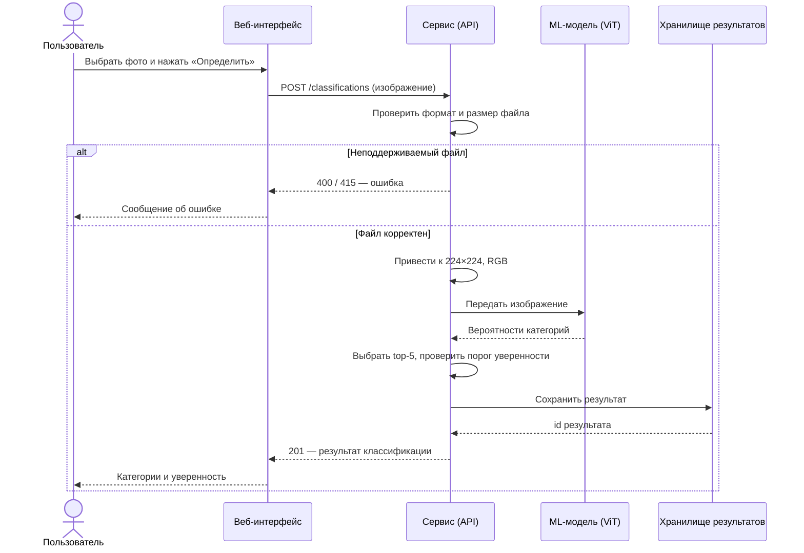
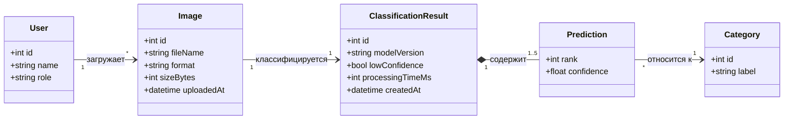

# Диаграммы

## Диаграмма последовательности

Диаграмма показывает выполнение сценария [UC-01. Классификация изображения](requirements.md#uc-01).

```mermaid
sequenceDiagram
    actor User as Пользователь
    participant UI as Веб-интерфейс
    participant API as Сервис (API)
    participant Model as ML-модель (ViT)
    participant DB as Хранилище результатов

    User->>UI: Выбрать фото и нажать «Определить»
    UI->>API: POST /classifications (изображение)
    API->>API: Проверить формат и размер файла
    alt Неподдерживаемый файл
        API-->>UI: 400 / 415 — ошибка
        UI-->>User: Сообщение об ошибке
    else Файл корректен
        API->>API: Привести к 224×224, RGB
        API->>Model: Передать изображение
        Model-->>API: Вероятности категорий
        API->>API: Выбрать top-5, проверить порог уверенности
        API->>DB: Сохранить результат
        DB-->>API: id результата
        API-->>UI: 201 — результат классификации
        UI-->>User: Категории и уверенность
    end
```

## Диаграмма классов

```mermaid
classDiagram
    direction LR
    class User {
        +int id
        +string name
        +string role
    }

    class Image {
        +int id
        +string fileName
        +string format
        +int sizeBytes
        +datetime uploadedAt
    }

    class ClassificationResult {
        +int id
        +string modelVersion
        +bool lowConfidence
        +int processingTimeMs
        +datetime createdAt
    }

    class Prediction {
        +int rank
        +float confidence
    }

    class Category {
        +int id
        +string label
    }

    User "1" --> "*" Image : загружает
    Image "1" --> "1" ClassificationResult : классифицируется
    ClassificationResult "1" *-- "1..5" Prediction : содержит
    Prediction "*" --> "1" Category : относится к
```
